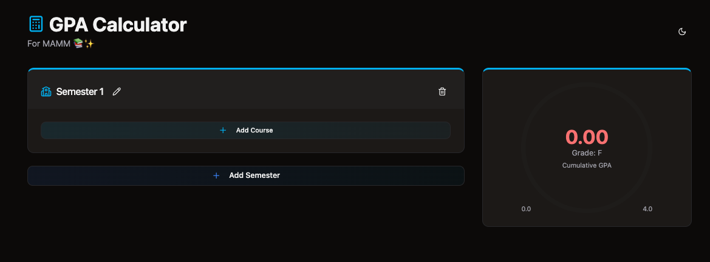

# GPA Calculator

A modern, interactive GPA calculator built with Next.js and Tailwind CSS. Calculate your semester and cumulative GPA with a beautiful, responsive interface.



## Features

- 📊 Real-time GPA calculation
- 💾 Automatic data saving
- 🌓 Dark/Light mode support
- 📱 Fully responsive design
- ✨ Smooth animations
- 🎨 Color-coded grades
- 📝 Editable semester names
- 🔄 Individual semester GPA tracking

## Tech Stack

- [Next.js 15](https://nextjs.org/) - React framework
- [Tailwind CSS](https://tailwindcss.com/) - Styling
- [Framer Motion](https://www.framer.com/motion/) - Animations
- [shadcn/ui](https://ui.shadcn.com/) - UI components
- [Lucide Icons](https://lucide.dev/) - Icons
- [TypeScript](https://www.typescriptlang.org/) - Type safety

## Getting Started

1. Clone the repository:
```bash
git clone https://github.com/yourusername/gpa-calculator.git
cd gpa-calculator
```